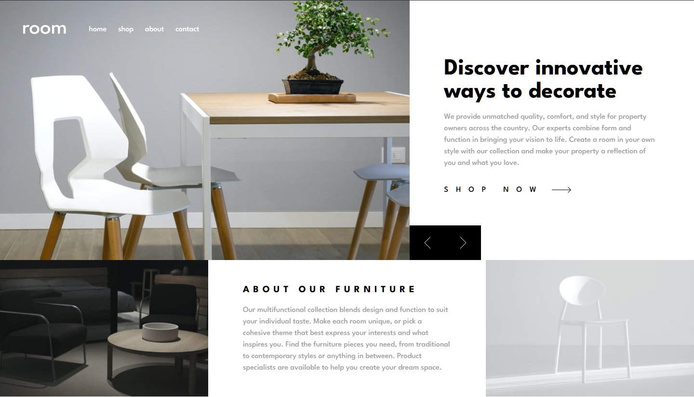
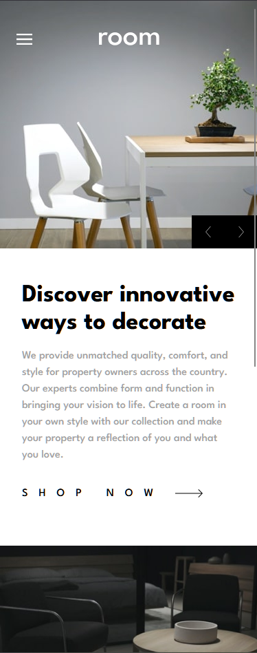
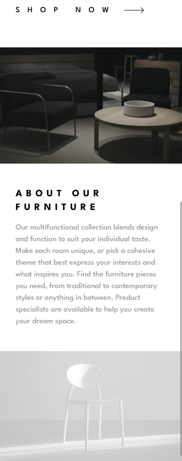
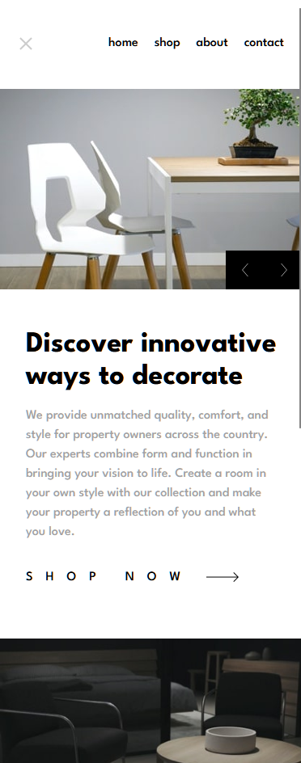

# Frontend Mentor - Room homepage solution

This is a solution to the [Room homepage challenge on Frontend Mentor](https://www.frontendmentor.io/challenges/room-homepage-BtdBY_ENq). Frontend Mentor challenges help you improve your coding skills by building realistic projects. 

## Table of contents

- [Overview](#overview)
  - [The challenge](#the-challenge)
  - [Screenshots](#screenshots)
  - [Links](#links)
- [My process](#my-process)
  - [Built with](#built-with)
  - [What I learned](#what-i-learned)
  - [Continued development](#continued-development)
  - [Useful resources](#useful-resources)
  - [AI Collaboration](#ai-collaboration)
- [Author](#author)

## Overview

### The challenge

Users should be able to:

- View the optimal layout for the site depending on their device's screen size
- See hover states for all interactive elements on the page
- Navigate the slider using either their mouse/trackpad or keyboard

### Screenshots

### Desktop

### Mobile

### Links

- Solution URL: https://github.com/williambrooks84/room-homepage
- Live Site URL: https://williambrooks84.github.io/room-homepage/

## My process

### Built with

- Semantic HTML5 markup
- [React](https://reactjs.org/)
- [TypeScript](https://www.typescriptlang.org/)
- [TailwindCSS](https://tailwindcss.com/)
- Flexbox
- CSS Grid
- Responsive design

### What I learned

This project helped me get more comfortable with responsive layouts and understanding how Flexbox and CSS Grid interact at different screen sizes. I also practiced managing states in React by building the image slider and added keyboard navigation for accessibility.

I learned more about responsive images with the `<picture>` element to use a different file depending on the screen's width. I also gained experience configuring Vite and deploying a React application to GitHub Pages.

### Continued development

I want to continue improving my responsive design skills, particularly when dealing with screen sizes where layouts can behave unexpectedly. I also want to improve how I manage accessibility and keyboard navigation in interactive React components.

### Useful resources

- [TailwindCSS documentation](https://tailwindcss.com/) - This documentation helped ,me find out how to do certain things in TailwindCSS? like letter spacing, making a button have a cursor pointer, the different ways of configuring a grid, etc.

### AI Collaboration

I used ChatGPT mainly as a learning and debugging tool. It helped me understand React and TypeScript errors, accessibility and keyboard navigation. I then implemented these solutions myself and tested them, then I made adjustments depending on what I wanted. It also helped me deploy the challenge to a GitHub page, telling me which commands to use to make a gh-pages branch which only contains the compiled files.a

## Author

- Website - [William Brooks](https://willbrooks.fr/)
- Frontend Mentor - [@yourusername](https://www.frontendmentor.io/profile/williambrooks84)